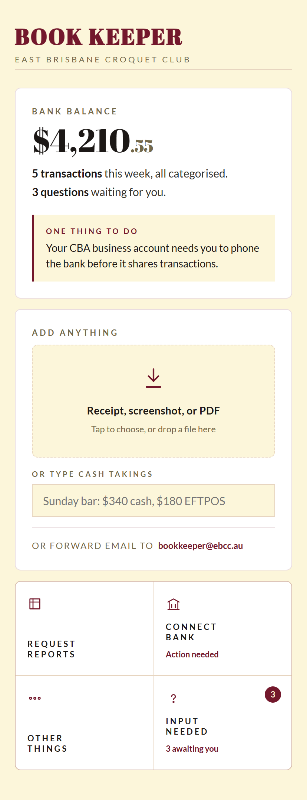
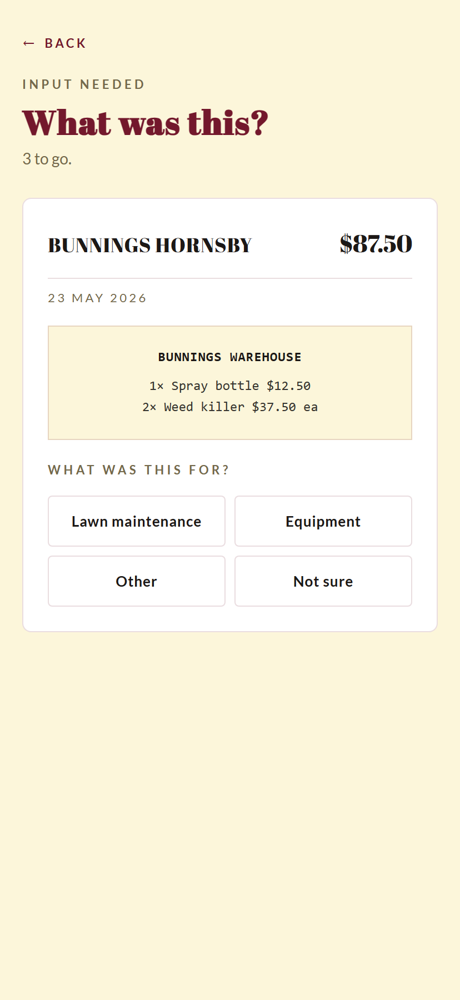
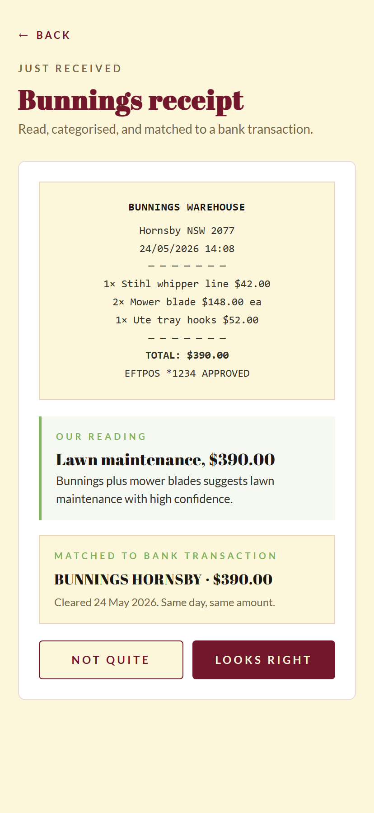
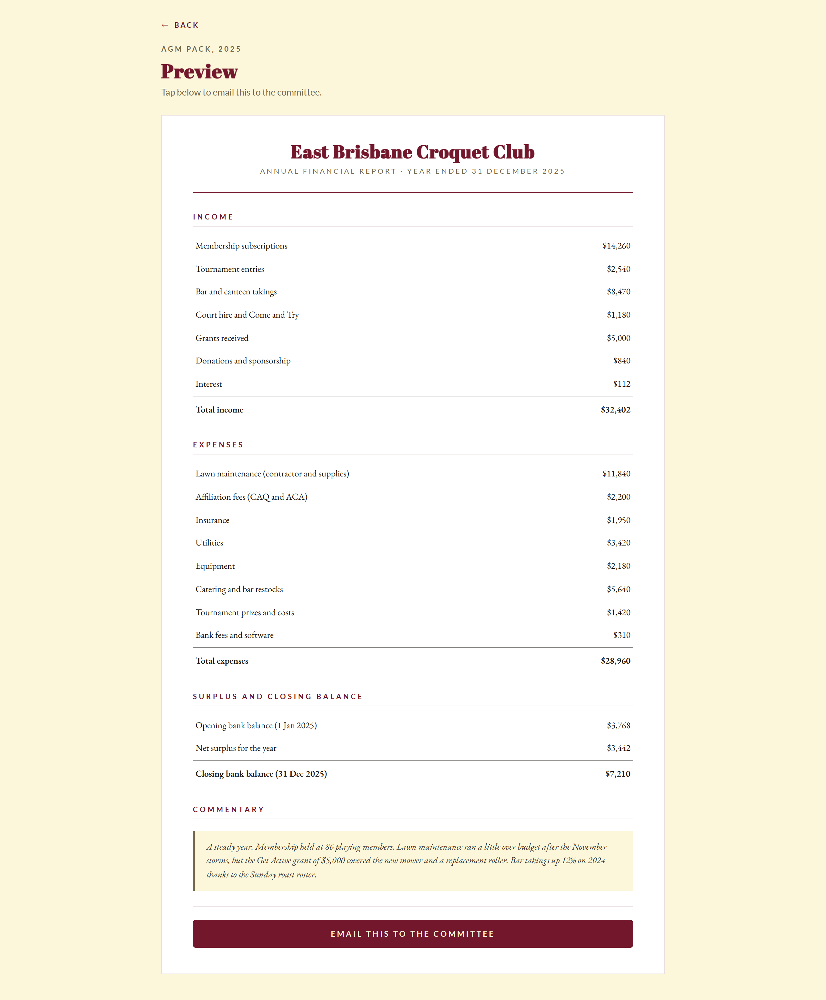

# The Treasurer Problem

*May 2026*

Every sporting club has a treasurer who didn't volunteer for the job. Most committees inherit a shoebox of receipts at the AGM. The next person says yes because nobody else would.

Wade asked me what we'd build if the treasurer's whole job had to fit on one screen.

---

## The problem under the workload

Bank reconciliation eats weekends. Grant acquittals come out of nowhere. The treasurer hands over at the AGM and the next one inherits a shoebox and a half-finished set of books.

Every committee already has Xero or MYOB or a spreadsheet. None of those tools have made treasurers happier. The problem is the *workload*: the categorising, the chasing, the matching, the report-building. Existing tools assume the treasurer wants to do accounting. What the treasurer actually wants is for someone else to do it.

---

## What one screen actually looks like

Wade sketched it in a notebook. One title bar at the top. One panel for the bank balance and anything that needs attention. One drop zone for receipts and invoices. Four buttons across the bottom. That's the entire app.

The four buttons cover everything that isn't dropping a file. Ask for a report. Manage the bank connection. See the questions saved up. Open the boring settings drawer.

Everything visible is the only thing there is.

---

## The treasurer's day

Bank transactions categorise themselves. The feed runs in the background. New transactions land in the ledger with a category guessed from the merchant, the amount, and the club's history. Most clear without human input. $2,200 to CAQ on the same date each year goes straight to "Affiliation fees" without asking.

When the category isn't certain, the transaction lands in the question queue and the home-screen badge ticks up.

Tap a category. It learns the rule and won't ask the next time it sees the same merchant.

The other intake path is a forwarded receipt. Photograph it on a phone, forward a supplier email, or drop a PDF. Anything financial-looking goes into the same drop zone.

What happens next is the work done out loud.

The photo goes up first. A quick beat with a filename and a progress bar, so the upload is visible. Then the AI side runs.

Reading the receipt. Finding the matching bank transaction. Putting the result in front of you. The steps are visible because they should be. Hidden AI work feels like a black box. Make it visible and it feels like a competent assistant instead.

You see the receipt, the AI's reading of it, and the matched bank transaction together. Tap "Looks right" and it's filed. Tap "Not quite" and it lands in the question queue.

When the receipt arrives before the bank transaction clears, it gets held and watched. The match happens automatically when the bank shows it.

---

## What it deliberately doesn't do

No GST or BAS lodgement; most clubs are below the threshold. No income tax return; most clubs are tax-exempt sporting bodies. No payroll. No invoicing or accounts receivable. No audit reports.

Tight scope makes it shippable. A club that outgrows it can export the data to Xero cleanly.

---

## Year-end

On the last day of the financial year, the treasurer receives the annual report draft.

Income by category. Expenses by category. Opening balance, surplus, closing balance. A short commentary written by the system, which the treasurer edits before sending to the committee. It exports as PDF and attaches to the AGM minutes.

The work that used to take a weekend takes ten minutes of review.

---

## What it costs

The bank feed comes through Basiq, the Australian plumbing that lets apps legally read bank transactions. The treasurer connects their bank once through a hosted screen Basiq runs. From then on, every new transaction triggers a webhook within minutes. We never see bank credentials.

Fifty cents per connected user per month for the data. Twenty-five cents for transaction enrichment. Basiq's Platform Access Fee sits above that and isn't published; it needs a quote. There's a Launchpad tier at $250 a month flat for six months. That's the sensible starting point for validation before per-user economics kick in.

The product doesn't need to be regulated. Bookkeeping isn't a licensed profession in Australia. Basiq holds the CDR accreditation, the ledger sits on our side, and the regulatory surface stays small.

---

## Where the project is

A clickable mockup with fake data. A design document covering the architecture and the choices behind it. A sketch on a notebook page that turned into a paired deliverable.

The mockup is at [croquetclaude.com/book-keeper/](/book-keeper/). Tap the drop zone in the middle of the home screen to walk through the receipt flow.

The build hasn't started. The board hasn't decided. The shoebox on the kitchen table is still there.
